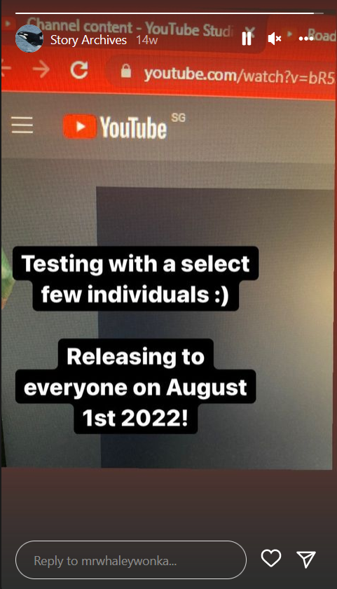
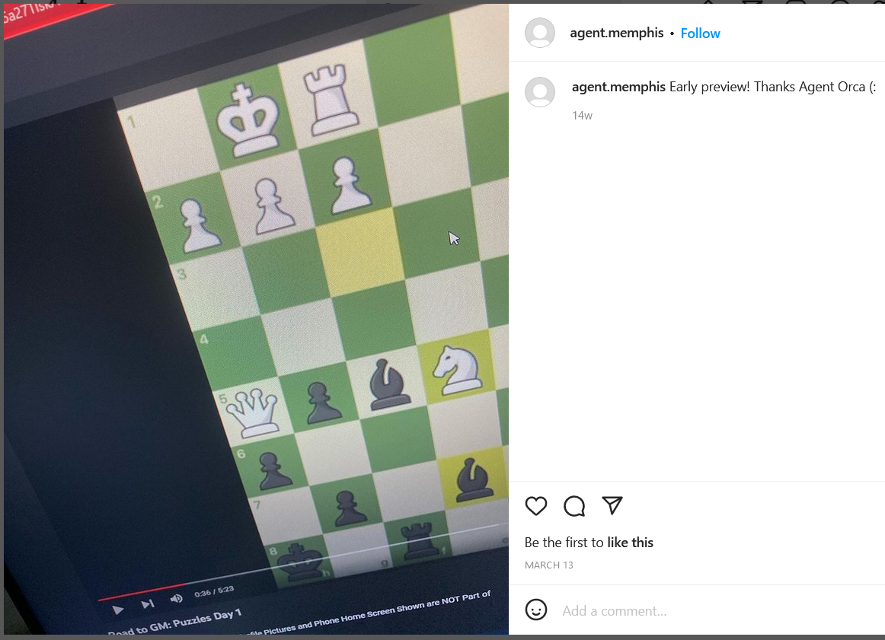
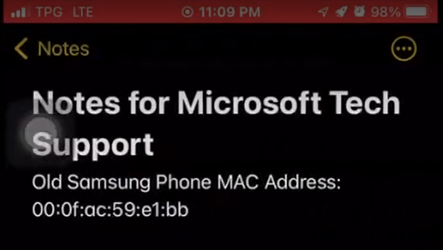
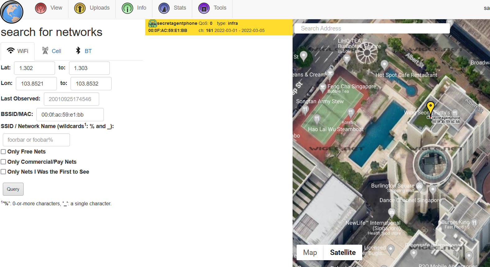
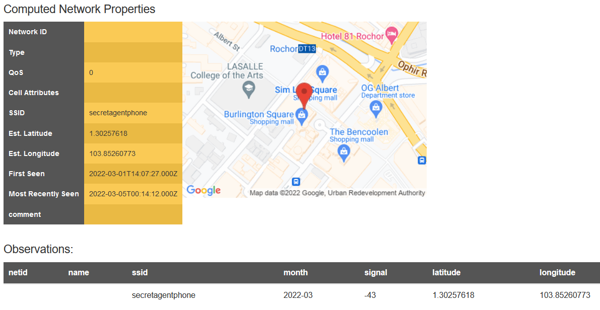
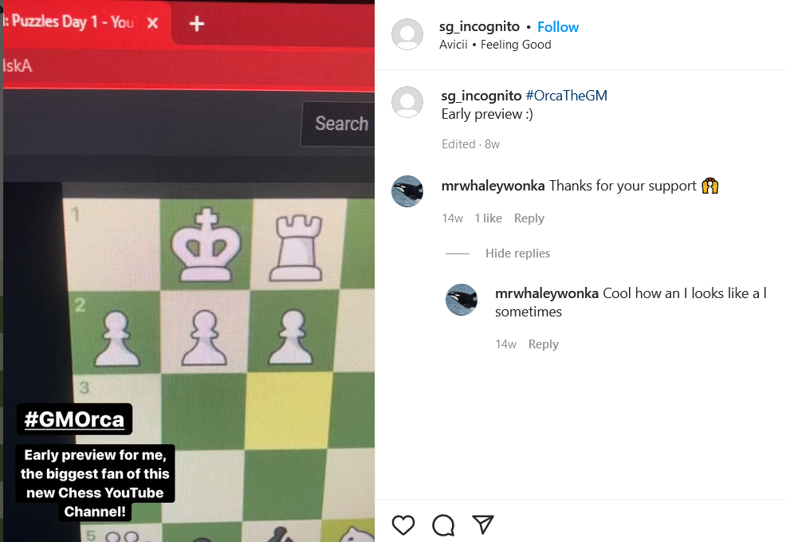

# I Sea You (Part 3)

## Description

> This is the third and final challenge of the "I SEA You Series"  
Good Job Once Again! We are on to them! We have intel that Agent Orca has replaced his old Samsung phone with a new Apple phone, and has left the Samsung Phone somewhere in Singapore!  
Use Orca's Instagram Account that you have obtained in Challenge 2 to locate the last seen location of Agent Orca's Phone.
You will need to find:
1.  The Name of the Building Agent Orca's Phone is at (lowercase, including numbers, and no spaces, if any)
2.  The Postal Code of that Building (only numbers)
And submit it in the format STANDCON22{\<the name of the building agent orca's phone is in\>\_\<postal code\>}

## Solution

In part two, we learned of Orcas Instagram Account – [mrwhaleywonka](https://www.instagram.com/p/CauzVrLP3Iq/).

Looking at their Story Archives, we see an image of a YouTube video.

The first three characters of the video ID can be seen in the top of the image. Video IDs are 11 characters long (e.g. https://www.youtube.com/watch?v=dQw4w9WgXcQ), so the challenge probably involved finding the remaining 8 characters.

Looking at the Likes of the [first image](https://www.instagram.com/p/CauzVrLP3Iq/), we see a user [agent.memphis](https://www.instagram.com/agent.memphis/), and their only post showing more of the video ID.

Zooming in to the link:

We can tell that there are 9 characters here, which means that the first character in the image is a ‘5’ from the story archive. We can also roughly see the next 4, ‘a27T’, and the last three characters: skA, giving us a partial link of bR5a27T\*skA. The last character would either be an upper case ‘i’ or a lower case ‘L’. One of them leads us to the [correct link](https://www.youtube.com/watch?v=bR5a27TIskA).

We see a screen recording of the user playing chess puzzles, occasionally looking through their notes. Around [2:14](https://youtu.be/bR5a27TIskA?t=134), we see the user clicking the wrong note and leaking the MAC address of their old phone.

I remembered an old [cyberdefenders challenge](https://cyberdefenders.org/blueteam-ctf-challenges/70) I did where we were asked to find the MAC address given a WiFi SSID. The question has since been removed but a writeup can be seen [here](https://faeez.rocks/2021/07/cyberdefenders-casevegas-walkthrough/) (question \#11). [Wigle](https://wigle.net/) can be used to search for connection locations from a MAC address in its basic and advanced search.

From there, we can see that the phone was last seen in Burlington Square (S189649).

STANDCON22{burlingtonsquare_189649}

## Additional notes

Did not find this before we found the flag but there was a hashtag \#GMOrca in one Orca’s post. Looking at other posts in this tag would bring us to [another user](https://www.instagram.com/sg_incognito/), with a post showing the last 4 characters of the video ID.

