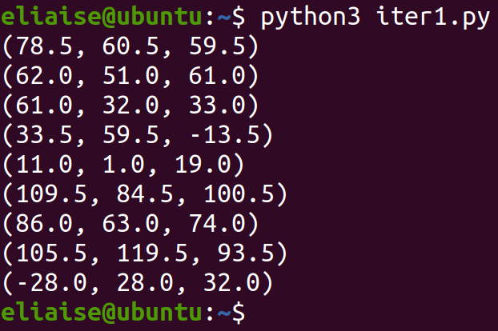
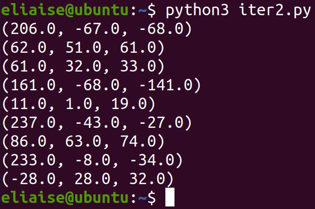
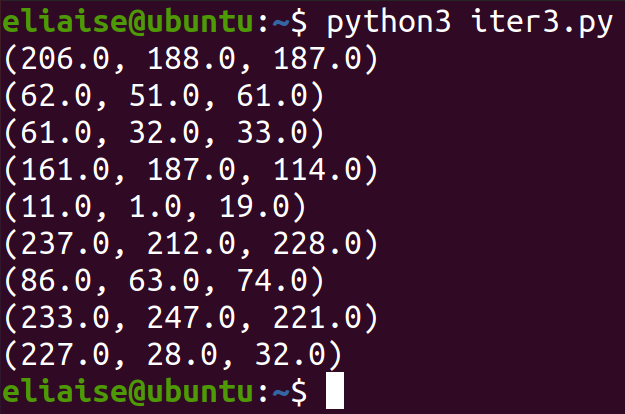
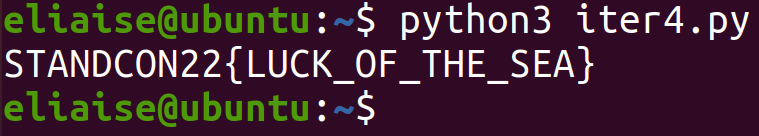

# Royal Colour Formula

## Description

> The study of Atlantean culture is endlessly fascinating. Professor Armadeus has written a short piece on the Royal Colour Formula. The flag you seek will appear if you manage to compute the previous Royal Colours.

Since the founding of Atlantis, each successive ruler has had their own distinct set of royal colours.

Each ruler always has nine (9) colours, which are determined by applying the Royal Colour Formula on the previous ruler's royal colours. Our understanding of the Royal Colour Formula is incomplete, but experts believe:

1. The order which the colours appear is significant and cannot be changed.
2. Each of the nine colours is determined solely by the previous color of it's position. (e.g. Colour first from left is determined by the previous colour first on left.)
3. The final appearance of the colour is not as important as the sub-colours it is made of. (This concept is especially confusing and hotly debated.)

With knowledge of the Royal Colour Formula and the current Royal Colours, one can predict what the next set of colours will look like. Indeed, by reversing the formula, one could even determine the very first set of Royal Colours used in Atlantis!  

Legend has it that the original royal colours of the first king of Atlantis contained a secret message. But that is pure speculation. Anyway, our records only stretch back to the reign of King Freddie FishFingus, great-grandfather of the present ruler.

## TL;DR

Let x, y and z be the RGB values of one of the current ruler's royal colours at index n.
To calculate the next ruler's royal colour at index n,

r = (x + y) % 255  
g = (y + z) % 255  
b = (x + z) % 255

## Solution

Start off by converting all the rulers' royal colours from their hex codes to RGB values. 
```python
frank = ['8b788a', '71707b', '5d415e', '5d2e14', '0c141e', 'c2b9d2', '9589a0', 'e1d5c7', '003c04']
fernando = ['cebcbb', '3e333d', '3d2021', 'a1bb72', '0b0113', 'edd4e4', '563f4a', 'e9f7dd', 'e31c20']
felicia = ['e6e7d4', '241a19', '1f1e02', '2c7546', '8e7c84', 'feeee5', 'b0a599', 'e702f5', 'f3ef2c']
freddie = ['e9fcea', '919287', '819d80', '7eadc7', '4b4339', 'fa04ea', '525e47', 'edf908', '18db14']

for j in range(9):
    print("{}\t\t{}\t\t{}\t\t{}".format(tuple(int(frank[j][k:k+2], 16) for k in (0, 2, 4)), 
    tuple(int(fernando[j][k:k+2], 16) for k in (0, 2, 4)), 
    tuple(int(felicia[j][k:k+2], 16) for k in (0, 2, 4)), 
    tuple(int(freddie[j][k:k+2], 16) for k in (0, 2, 4))))
    print("\n")
```

A bit of eye-balling later and I noticed that the blue value of one of the rulers was obtained from the previous ruler's red and blue values. It is modded by 255 (or deducted by 255) if the new value exceeds 255. I tried the same thing for the other values and I arrived at the following statements:
```
r = (x + y) % 255
g = (y + z) % 255
b = (x + z) % 255
```
This point onwards is secondary school mathematics. Given r, g, and b, we can find x by doing:
> x = (r + b - g)/2

Using x, we can find the y and z:
> y = r - x  
> z = b - x

First attempt:
```python
frank = [(139, 120, 138), (113, 112, 123), (93, 65, 94), (93, 46, 20), (12, 20, 30), (194, 185, 210), (149, 137, 160), (225, 213, 199), (0, 60, 4)]

for r, g, b in frank:
	x = (r + b - g) / 2
	y = r - x
	z = b - x
	print("({}, {}, {})".format(x, y, z))
```


We are left with some odd numbers. This is due to the fact that the values that exceed 255 are deducted by 255. An even number deducted by an odd number will result in an odd number. So we add a check that if the result of (r + b - g) is an odd number, we add 255 to it.

Second attempt:
```python
frank = [(139, 120, 138), (113, 112, 123), (93, 65, 94), (93, 46, 20), (12, 20, 30), (194, 185, 210), (149, 137, 160), (225, 213, 199), (0, 60, 4)]

for r, g, b in frank:
	xx = (r + b - g)
	if xx % 2:
		xx += 255
	x = xx / 2
	y = r - x
	z = b - x
	print("({}, {}, {})".format(x, y, z))
```


We are getting closer. We have negative numbers for some reason. Let's add 255 the numbers that are negative.

Third attempt:
```python
frank = [(139, 120, 138), (113, 112, 123), (93, 65, 94), (93, 46, 20), (12, 20, 30), (194, 185, 210), (149, 137, 160), (225, 213, 199), (0, 60, 4)]

for r, g, b in frank:
	xx = (r + b - g)
	if xx % 2:
		xx += 255
	x = xx / 2
	y = r - x
	z = b - x
	if x < 0:
		x += 255
	if y < 0:
		y += 255
	if z < 0:
		z += 255
	print("({}, {}, {})".format(x, y, z))
```


Nice, we got it. Now to loop this until we get the flag. The flag is in the format of STANDCON{xxxx} and an ASCII character is represented by 7 bits. We check if the first colour's RGB values spell out "STA".
```python
frank = [(139, 120, 138), (113, 112, 123), (93, 65, 94), (93, 46, 20), (12, 20, 30), (194, 185, 210), (149, 137, 160), (225, 213, 199), (0, 60, 4)]
next = frank
index = 0

while True:
	for r, g, b in next:
		xx = (r + b - g)
		if xx % 2:
			xx += 255
		x = int(xx / 2)
		y = int(r - x)
		z = int(b - x)
		if x < 0:
			x += 255
		if y < 0:
			y += 255
		if z < 0:
			z += 255
		
		next[index % 9] = (x, y, z)
		index += 1
	
	r, g, b = next[0]
	if chr(r) == 'S' and chr(g) == 'T' and chr(b) == 'A':
		flag = ""
		for r, g, b in next:
			flag += chr(r) + chr(g) + chr(b)
		print(flag)
		exit(1)
```


Flag: STANDCON22{LUCK_OF_THE_SEA}