# Maze Repo

## Description

>You are about to witness a repository that has more than it meets the eye! Some think it as a maze but I would say it's the mirror that deceives you the most :)
nc xx.xxx.xx.xxx xxxxx

## TL;DR

Find .git repo in backup folder, dump and use git extractor to find users.db, crack hash and login.

## Solution

The web page shows a login page.

Initial directory and file scanning revealed a backup folder in the site.

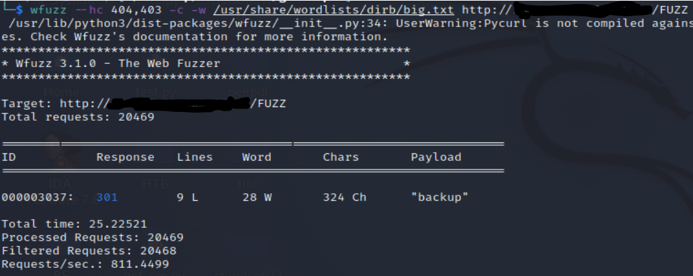

The backup contains a users.db that has nothing inside.

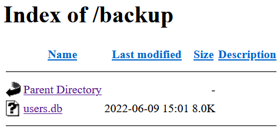

At this point, I relooked at the challenge title description and how it was hinting at git (repository, mirror). Navigating to backup/.git confirms my suspicions.

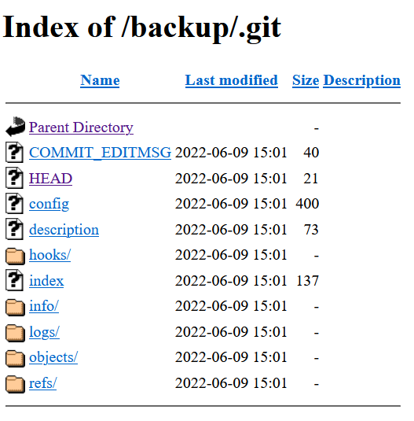

The intended way to discover this was probably to scan for hidden files and directories.

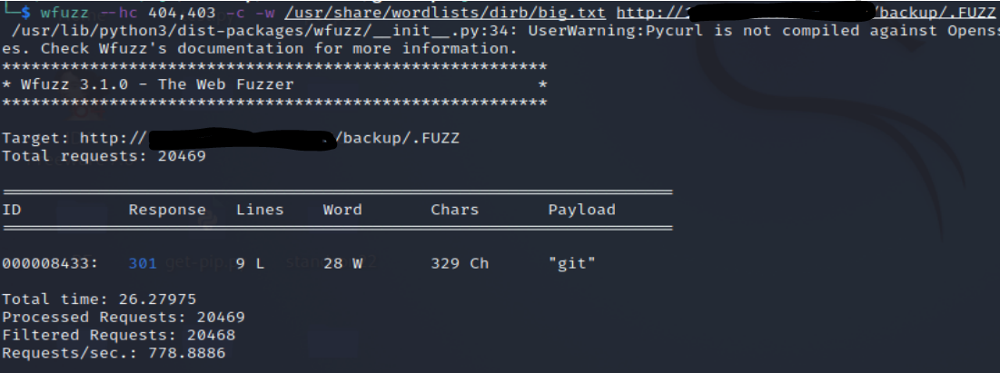

There are tools online to help download the entire .git repository. I used [gitdumper](https://github.com/internetwache/GitTools/tree/master/Dumper) from [GitTools](https://github.com/internetwache/GitTools).

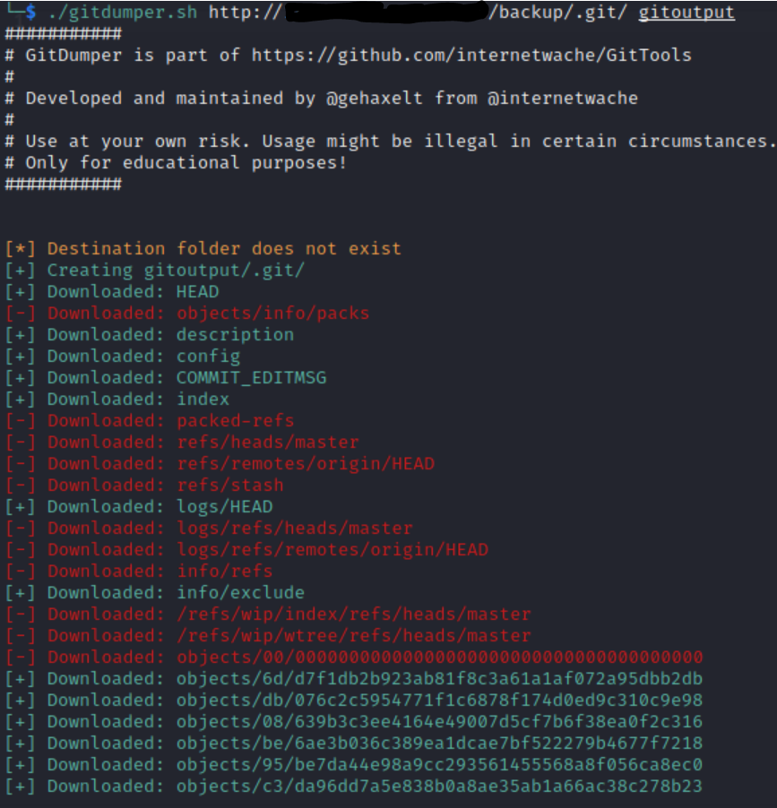

Tried to view the commit history using “git log” but there was nothing there.

I used the [extractor](https://github.com/internetwache/GitTools/tree/master/Extractor) script from GitTools to extract commits as the repository seemed to be broken. Three commits were found and it gave me three versions of users.db.

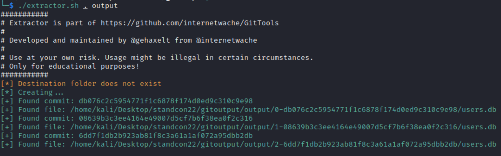

Looking through the commit data shows that the database was added and then subsequently removed.

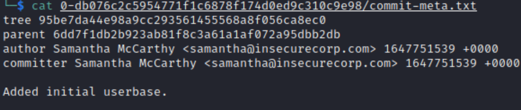

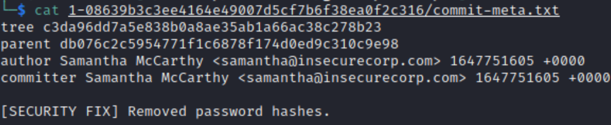

Looking through the users.db shows us some login credentials.

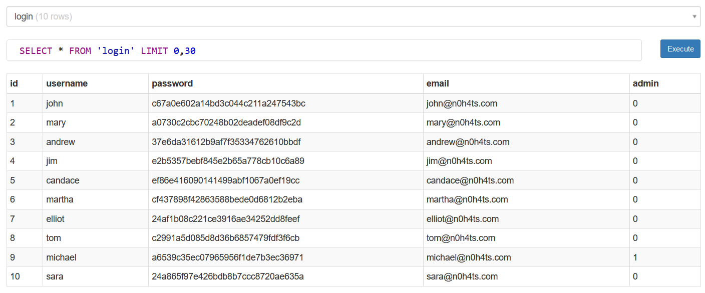

[Crackstation](https://crackstation.net/) was able to find two of the hashes.

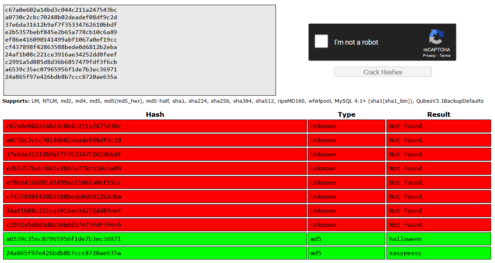

Logging in as michael:halloween would give us the flag.

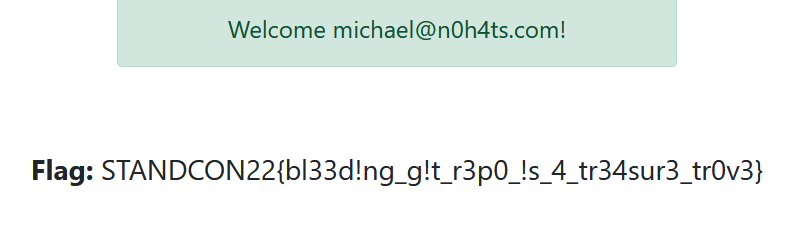
