Vim Hurts

To start the challenge, we will need to connect to \`nc 18.141.84.203 61003\` create an instance of the challenge for us. For our instance it was created at http://18.141.84.203:62546/

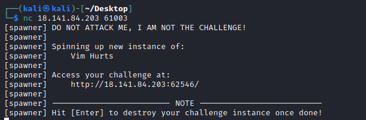

Visiting the web page shows a file upload page. Based on the challenge description, there is a vulnerability in uploading the file. Files uploaded successfully can be found in /uploads on the web server. The folders that were able to be listed can be seen in a figure later on.

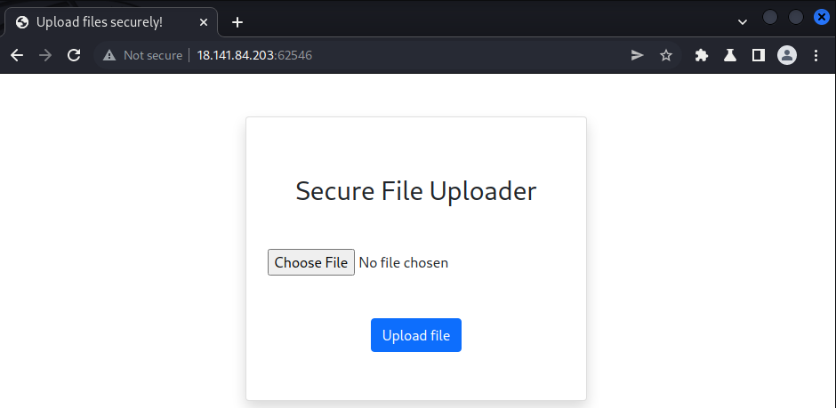

Attempts to upload a non-image fails as jpg and png files are allowed only. Techniques such as using different extensions, changing the content type, and even embedding an image with php shellcode still failed.

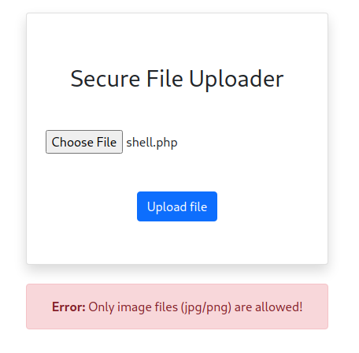

Inside the html source code, the file is being uploaded to the same page

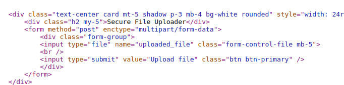

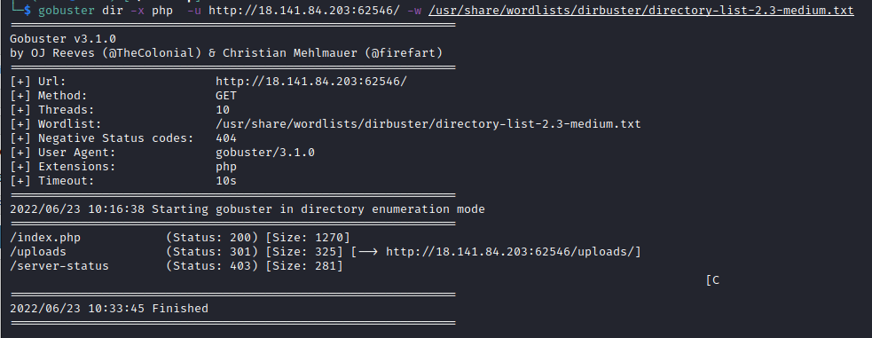

Given the challenge name and the fact that the admin did not exit vim, suggests that a .swp file exists on the server. The purpose of the swap file is to store the recovery version of a file being edited in the program. SWP files also serve as lock files, so no other Vi editing session can concurrently write to the currently open file.

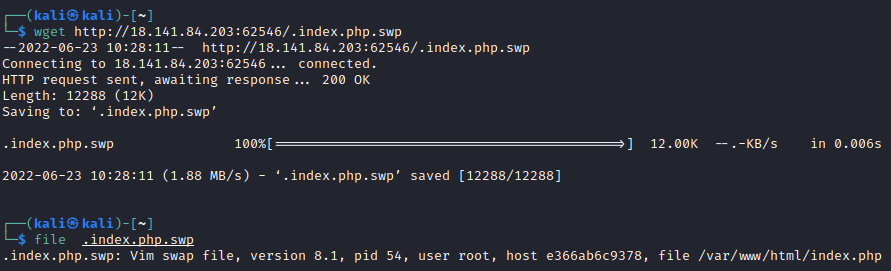

We can do a \`vim index.php.swp\` to recover the file open in vim.

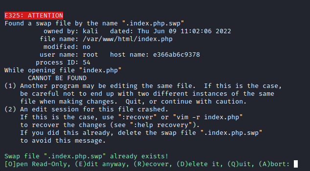

We go ahead and recover the *index.php* file that was found within the swap file.

Upon opening the file in a text editor, it can be seen that several checks are required to pass for the file to be in the /upload directory.

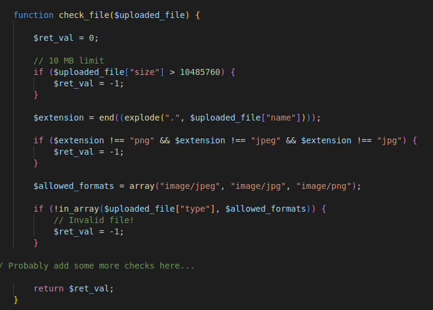

In addition, only alphanumeric and “.\_-” characters were allowed in the file name.

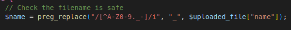

Interestingly, the file is moved to \`/uploads/\` directory before the file is being checked. Files that do not pass the *check_file* function will be sent to be quarantined in /tmp.

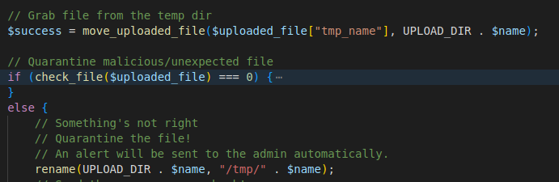

Since the files will exist in “/uploads/”, we can attempt to serve our web shell before it is quarantined by the server. In addition to that, we can make it such that our web shell will be able to replicate itself as the server will only quarantine the original file.

Our shell script is as follows:

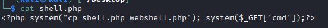

In addition, we will have another script to continuously curl the webserver to run our *shell.php* on the server.

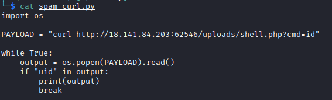

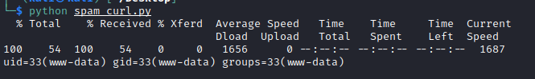

Testing our copied web shell at /uploads/webshell.php confirms that it works!!

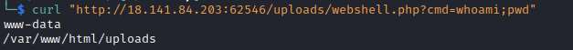

The flag is found in \`/flag.txt\`

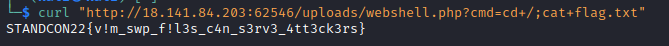

STANDCON22{v!m_swp_f!l3s_c4n_s3rv3_4tt3ck3rs}
